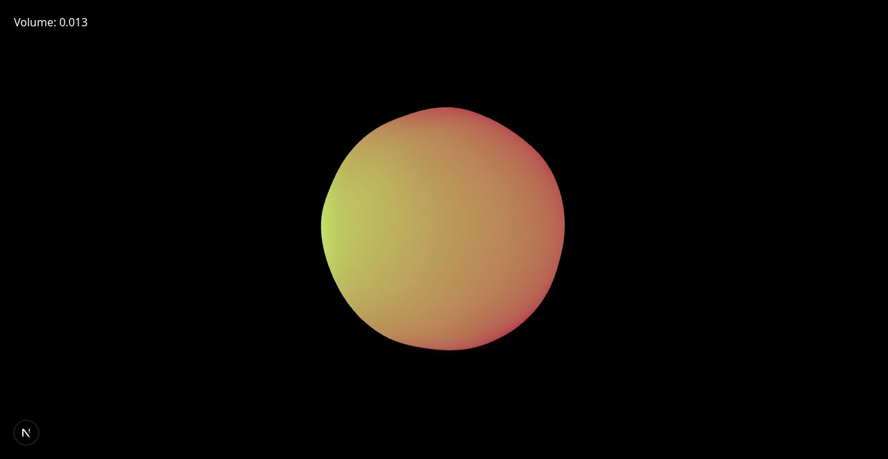
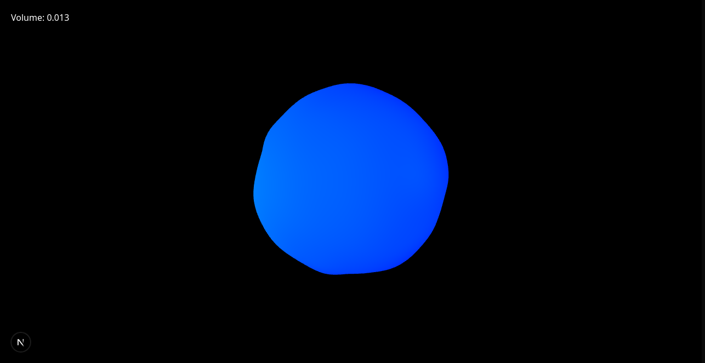

# Blob3D

Blob3D is a 3D component project built using Three.js and React. It creates an animated blob with customizable themes and gradients.

## Features

- 3D blob rendering with WebGL using Three.js
- Customizable gradients and themes
- Utilizes shaders for dynamic visual effects
- Audio-based interaction, adjusts blob intensity based on microphone input

## Installation

1. Clone the repository:
   ```bash
   git clone https://github.com/yourusername/blob3d.git
   cd blob3d
   ```

2. Install the dependencies:
   ```bash


   npm install
   ```
## Screenshots




## Usage

### Development

To start the development server, run:
```bash
npm run dev
```

### Build

To build the project for production, run:
```bash
npm run build
```

### Start

To start the production server, run:
```bash
npm start
```

## Configuration

- The project uses Tailwind CSS for styling. Configuration can be found in `postcss.config.mjs`.
- Custom shaders are used for the blob's visual effects, located in `app/components/vertexShader.tsx` and `app/components/fragmentShader.tsx`.

## License

This project is licensed under the MIT License.
